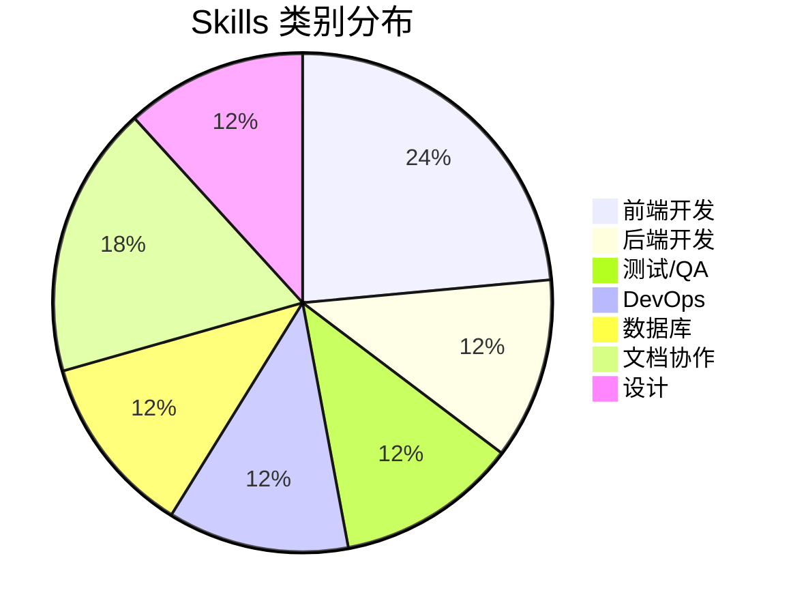

# 🛠️ OpenClaw 软件开发 Skills 完全清单

> 提升开发效率的终极指南 · 2026 版  
> 📅 更新时间：2026-03-05 | 📊 版本：1.0

---

## 📖 目录

1. [Skills 总览](#-skills-总览)
2. [前端开发 Skills](#-前端开发-skills)
3. [后端开发 Skills](#-后端开发-skills)
4. [测试与 QA Skills](#-测试与-qa-skills)
5. [DevOps Skills](#-devops-skills)
6. [数据库 Skills](#-数据库-skills)
7. [文档与协作](#-文档与协作)
8. [角色推荐组合](#-角色推荐组合)

---

## 🎯 Skills 总览

### 技能矩阵

| Skill | 类别 | 难度 | 效率提升 | 推荐指数 |
|:------|:----:|:----:|:--------:|:--------:|
| **frontend-design-3** | 前端 | ⭐⭐ | ⭐⭐⭐⭐⭐ | ⭐⭐⭐⭐⭐ |
| **github** | 协作 | ⭐ | ⭐⭐⭐⭐ | ⭐⭐⭐⭐⭐ |
| **shadcn-ui** | 前端 | ⭐⭐ | ⭐⭐⭐⭐ | ⭐⭐⭐⭐⭐ |
| **tailwind-design-system** | 前端 | ⭐⭐⭐ | ⭐⭐⭐⭐ | ⭐⭐⭐⭐ |
| **ui-ux-design** | 设计 | ⭐⭐ | ⭐⭐⭐⭐ | ⭐⭐⭐⭐⭐ |
| **ui-audit** | 审查 | ⭐⭐ | ⭐⭐⭐ | ⭐⭐⭐⭐ |
| **tavily-search** | 搜索 | ⭐⭐ | ⭐⭐⭐⭐ | ⭐⭐⭐⭐⭐ |
| **summarize** | 学习 | ⭐⭐ | ⭐⭐⭐⭐ | ⭐⭐⭐⭐ |

### 技能分布图



---

## 💻 前端开发 Skills

### 1. frontend-design-3 ⭐⭐⭐⭐⭐

**前端界面设计生成器**

```bash
clawhub install frontend-design-3
```

#### 功能特性

- 🎨 **独特的前端界面设计** - 避免通用 AI 美学
- 🚀 **生产级代码生成** - 可直接用于生产环境
- ✨ **高设计质量** - 精致的 UI 组件
- 🎯 **现代技术栈** - React + Tailwind CSS

#### 使用示例

```
使用 frontend-design-3 设计一个登录页面
- 使用 React + Tailwind CSS
- 包含邮箱和密码输入框
- 添加"记住我"和"忘记密码"功能
- 响应式设计，支持移动端
- 深色模式支持
```

#### 生成代码示例

```jsx
// 自动生成的登录组件
import { useState } from 'react'

export default function LoginPage() {
  const [email, setEmail] = useState('')
  const [password, setPassword] = useState('')
  
  return (
    <div className="min-h-screen flex items-center justify-center bg-gray-50">
      <div className="max-w-md w-full space-y-8 p-8 bg-white rounded-lg shadow">
        <h2 className="text-3xl font-bold text-center">欢迎登录</h2>
        <input
          type="email"
          value={email}
          onChange={(e) => setEmail(e.target.value)}
          className="w-full px-4 py-2 border rounded-lg"
          placeholder="邮箱"
        />
        {/* ... 更多代码 */}
      </div>
    </div>
  )
}
```

---

### 2. shadcn-ui ⭐⭐⭐⭐⭐

**shadcn/ui 组件库集成**

```bash
clawhub install shadcn-ui
```

#### 功能特性

- 🧱 **现代组件库** - 基于 Radix UI
- 🎨 **Tailwind CSS 样式** - 易于定制
- 📝 **表单解决方案** - react-hook-form + zod
- 🌗 **主题/深色模式** - 开箱即用
- 📱 **响应式布局** - 移动端优先

#### 使用示例

```
使用 shadcn-ui 创建一个用户资料页面
- 使用 Card 组件展示用户信息
- 添加 Avatar 头像
- 包含编辑资料的表单
- 使用 Tabs 切换不同设置
```

#### 常用组件

| 组件 | 用途 | 示例 |
|------|------|------|
| Button | 按钮 | `<Button variant="primary">` |
| Card | 卡片容器 | `<Card><CardHeader>...` |
| Input | 输入框 | `<Input placeholder="输入...">` |
| Dialog | 对话框 | `<Dialog><DialogTrigger>...` |
| Tabs | 标签页 | `<Tabs><TabsList>...` |
| Table | 表格 | `<Table><TableHeader>...` |

---

### 3. tailwind-design-system ⭐⭐⭐⭐

**Tailwind 设计系统**

```bash
clawhub install tailwind-design-system
```

#### 功能特性

- 🎨 **可扩展组件库** - 基于 Tailwind CSS
- 🔄 **CVA 变体系统** - 灵活的组件变体
- 🧩 **复合组件** - 组合式 API
- 🎯 **设计令牌** - 统一的设计语言
- 🌗 **深色模式** - 自动适配

#### 使用示例

```
使用 tailwind-design-system 创建按钮组件
- 定义 primary、secondary、danger 变体
- 支持 sm、md、lg 尺寸
- 添加 loading 状态
- 支持图标位置（左/右）
```

---

### 4. ui-ux-design ⭐⭐⭐⭐⭐

**UI/UX 设计指导**

```bash
clawhub install ui-ux-design
```

#### 功能特性

- 📱 **移动优先设计** - 响应式布局指导
- 🎨 **色彩系统** - 配色方案建议
- 🔤 **排版设计** - 字体层次结构
- ♿ **无障碍设计** - WCAG 2.2 合规
- 🌙 **深色模式** - 主题切换设计
- ✨ **微交互** - 动画和过渡效果

#### 使用示例

```
使用 ui-ux-design 审查我的仪表板设计
- 检查色彩对比度
- 评估信息层次
- 优化用户操作流程
- 确保无障碍访问
```

---

### 5. ui-audit ⭐⭐⭐⭐

**UI 界面审查**

```bash
clawhub install ui-audit
```

#### 功能特性

- 🔍 **设计质量评估** - 专业审查
- 📊 **最佳实践检查** - 行业标准
- 🐛 **问题诊断** - 发现设计缺陷
- ✅ **改进建议** - 具体优化方案

#### 审查清单

```
使用 ui-audit 审查登录页面：

✅ 视觉层次
  - 标题是否清晰
  - CTA 按钮是否突出
  - 信息密度是否合适

✅ 可用性
  - 表单验证是否友好
  - 错误提示是否清晰
  - 加载状态是否明确

✅ 无障碍性
  - 颜色对比度是否达标
  - 键盘导航是否支持
  - 屏幕阅读器是否兼容
```

---

## 🔧 后端开发 Skills

### 6. github ⭐⭐⭐⭐⭐

**GitHub 集成**

```bash
clawhub install github
```

#### 功能特性

- 📝 **Issue 管理** - 创建、查询、关闭
- 🔀 **Pull Request** - 代码审查协作
- 📊 **项目管理** - 看板、里程碑
- 👥 **团队协作** - 分配、通知

#### 使用示例

```
# 创建 Issue
在 GitHub 创建一个新的 Issue
- 标题：修复登录页面加载缓慢问题
- 标签：bug, performance, frontend
- 指派给：@developer
- 里程碑：v2.0

# 查询 Issue
列出所有未关闭的 bug 类型 Issue
按优先级排序
```

#### 常用命令

```bash
# 创建 Issue
github issue create --title "Bug 描述" --label bug

# 查询 Issue
github issue list --state open --label bug

# 查看 Issue 详情
github issue view #123

# 关闭 Issue
github issue close #123
```

---

### 7. tavily-search ⭐⭐⭐⭐⭐

**AI 优化搜索引擎**

```bash
clawhub install tavily-search
```

#### 功能特性

- 🎯 **AI 友好摘要** - 干净的搜索结果
- 📰 **新闻模式** - 追踪最新技术动态
- 🔍 **深度搜索** - 全面的研究模式
- 🌐 **网页提取** - 获取完整内容

#### 使用示例

```
# 技术方案调研
使用 tavily-search 调研 Node.js 最佳实践
- 查找 2025-2026 年的最新指南
- 关注性能优化方面
- 提取官方文档内容

# API 文档查询
搜索 Next.js 14 App Router 的使用教程
提取代码示例
```

---

### 8. summarize ⭐⭐⭐⭐

**智能摘要工具**

```bash
clawhub install summarize
```

#### 功能特性

- 📄 **长文摘要** - 快速理解技术文档
- 📹 **YouTube 总结** - 技术视频要点
- 📕 **PDF 摘要** - 论文/文档速读
- 🌍 **多语言支持** - 跨语言学习

#### 使用示例

```
# 技术文档摘要
总结这篇 React 性能优化指南
- 提取关键优化技巧
- 列出代码示例
- 长度：中等

# 视频教程总结
总结这个 Next.js 教程视频
- 提取主要知识点
- 列出时间戳
- 生成学习笔记
```

---

## 🧪 测试与 QA Skills

### 9. test-generator (推荐)

**测试代码生成**

```bash
clawhub install test-generator
```

#### 功能特性

- ✅ **单元测试生成** - Jest/Vitest
- 🧪 **集成测试** - 端到端测试
- 📝 **测试用例设计** - 边界条件覆盖
- 🔄 **Mock 数据** - 测试数据生成

#### 使用示例

```
为登录组件生成测试用例
- 测试表单验证
- 测试成功登录
- 测试错误处理
- 测试边界条件
- 使用 Jest + React Testing Library
```

#### 生成的测试代码

```jsx
import { render, screen, fireEvent } from '@testing-library/react'
import LoginPage from './LoginPage'

describe('LoginPage', () => {
  it('渲染登录表单', () => {
    render(<LoginPage />)
    expect(screen.getByPlaceholderText('邮箱')).toBeInTheDocument()
    expect(screen.getByPlaceholderText('密码')).toBeInTheDocument()
  })

  it('验证邮箱格式', async () => {
    render(<LoginPage />)
    fireEvent.change(screen.getByPlaceholderText('邮箱'), {
      target: { value: 'invalid-email' }
    })
    expect(await screen.findByText('邮箱格式不正确')).toBeInTheDocument()
  })

  it('成功登录', async () => {
    render(<LoginPage />)
    fireEvent.change(screen.getByPlaceholderText('邮箱'), {
      target: { value: 'test@example.com' }
    })
    fireEvent.change(screen.getByPlaceholderText('密码'), {
      target: { value: 'password123' }
    })
    fireEvent.click(screen.getByRole('button', { name: '登录' }))
    expect(await screen.findByText('登录成功')).toBeInTheDocument()
  })
})
```

---

### 10. code-review (推荐)

**代码审查助手**

```bash
clawhub install code-review
```

#### 功能特性

- 🔍 **代码质量检查** - 最佳实践
- 🐛 **潜在 Bug 检测** - 常见问题
- 🔒 **安全审查** - 漏洞扫描
- 📊 **性能建议** - 优化方案

#### 审查维度

```
代码审查检查清单：

✅ 代码规范
  - 命名是否清晰
  - 格式是否一致
  - 注释是否充分

✅ 代码质量
  - 函数是否单一职责
  - 是否有重复代码
  - 错误处理是否完善

✅ 安全性
  - SQL 注入防护
  - XSS 防护
  - 认证授权检查

✅ 性能
  - 是否有 N+1 查询
  - 缓存策略是否合理
  - 资源是否正确释放
```

---

## 🚀 DevOps Skills

### 11. docker-skill (推荐)

**Docker 容器化**

```bash
clawhub install docker-skill
```

#### 功能特性

- 🐳 **Dockerfile 生成** - 多阶段构建
- 📦 **镜像优化** - 体积优化
- 🔧 **容器编排** - Docker Compose
- 🌐 **网络配置** - 容器网络

#### 使用示例

```
为 Node.js 应用创建 Dockerfile
- 使用多阶段构建
- 优化镜像大小
- 配置生产环境变量
- 添加健康检查
```

#### 生成的 Dockerfile

```dockerfile
# 构建阶段
FROM node:22-alpine AS builder
WORKDIR /app
COPY package*.json ./
RUN npm ci --only=production
COPY . .
RUN npm run build

# 生产阶段
FROM node:22-alpine
WORKDIR /app
COPY --from=builder /app/dist ./dist
COPY --from=builder /app/node_modules ./node_modules
EXPOSE 3000
HEALTHCHECK --interval=30s --timeout=3s CMD curl -f http://localhost:3000/health
CMD ["node", "dist/index.js"]
```

---

### 12. ci-cd-skill (推荐)

**CI/CD 流水线**

```bash
clawhub install ci-cd-skill
```

#### 功能特性

- 🔄 **GitHub Actions** - 自动化工作流
- 🧪 **自动化测试** - 持续集成
- 📦 **自动部署** - 持续部署
- 🔔 **通知集成** - Slack/Discord

#### 使用示例

```
创建 GitHub Actions 工作流
- 代码推送时运行测试
- 测试通过后构建 Docker 镜像
- 推送到 Docker Hub
- 部署到生产环境
```

---

## 🗄️ 数据库 Skills

### 13. prisma-skill (推荐)

**Prisma ORM**

```bash
clawhub install prisma-skill
```

#### 功能特性

- 📊 **数据建模** - Schema 设计
- 🔍 **类型安全查询** - TypeScript 支持
- 🔄 **迁移管理** - 数据库版本控制
- 📝 **种子数据** - 测试数据生成

#### 使用示例

```
使用 Prisma 设计用户系统 Schema
- User 模型（id、邮箱、密码、角色）
- Profile 模型（一对一关联）
- Post 模型（一对多关联）
- 添加索引和约束
```

#### Schema 示例

```prisma
model User {
  id        String   @id @default(uuid())
  email     String   @unique
  password  String
  role      Role     @default(USER)
  profile   Profile?
  posts     Post[]
  createdAt DateTime @default(now())
  updatedAt DateTime @updatedAt
}

model Profile {
  id     String  @id @default(uuid())
  bio    String?
  avatar String?
  userId String  @unique
  user   User    @relation(fields: [userId], references: [id])
}

enum Role {
  USER
  ADMIN
}
```

---

### 14. redis-skill (推荐)

**Redis 缓存**

```bash
clawhub install redis-skill
```

#### 功能特性

- ⚡ **缓存策略** - 性能优化
- 🔑 **会话管理** - 用户状态
- 📊 **数据结构** - 多种数据类型
- 🔄 **发布订阅** - 实时通信

---

## 📝 文档与协作

### 15. feishu-doc ⭐⭐⭐⭐⭐

**飞书文档集成**

```bash
# 已内置，需要配置飞书凭证
```

#### 功能特性

- 📄 **文档读写** - 创建、更新、读取
- 📊 **表格操作** - 数据管理
- 👥 **权限管理** - 协作控制
- 🔔 **消息通知** - 自动推送

#### 使用示例

```
在飞书创建技术文档
- 标题：API 接口文档 v2.0
- 内容：包含接口列表、请求示例、响应格式
- 分享给开发团队
- 设置编辑权限
```

---

### 16. notion (推荐)

**Notion 集成**

```bash
clawhub install notion
```

#### 功能特性

- 📝 **页面管理** - 知识库建设
- 📊 **数据库** - 项目管理
- 🔗 **关联页面** - 知识网络
- 🎨 **模板系统** - 快速创建

---

### 17. obsidian (推荐)

**Obsidian 知识管理**

```bash
clawhub install obsidian
```

#### 功能特性

- 🔗 **双向链接** - 知识关联
- 📊 **知识图谱** - 可视化展示
- 📝 **Markdown 编辑** - 本地存储
- 🔌 **插件生态** - 功能扩展

---

## 🎯 角色推荐组合

### 👨‍💻 前端开发工程师

```bash
# 核心组合
clawhub install frontend-design-3
clawhub install shadcn-ui
clawhub install tailwind-design-system
clawhub install ui-ux-design

# 辅助工具
clawhub install github
clawhub install tavily-search
clawhub install summarize
```

**工作流：**
1. `ui-ux-design` - 设计审查和指导
2. `frontend-design-3` - 生成初始代码
3. `shadcn-ui` - 使用组件库优化
4. `tailwind-design-system` - 统一样式系统

---

### 👨‍💻 后端开发工程师

```bash
# 核心组合
clawhub install github
clawhub install tavily-search
clawhub install prisma-skill
clawhub install redis-skill

# 辅助工具
clawhub install code-review
clawhub install summarize
clawhub install docker-skill
```

**工作流：**
1. `tavily-search` - 技术方案调研
2. `prisma-skill` - 数据库设计
3. `code-review` - 代码质量检查
4. `docker-skill` - 容器化部署

---

### 🧪 测试工程师/QA

```bash
# 核心组合
clawhub install test-generator
clawhub install code-review
clawhub install github

# 辅助工具
clawhub install tavily-search
clawhub install summarize
clawhub install ci-cd-skill
```

**工作流：**
1. `test-generator` - 生成测试用例
2. `code-review` - 代码审查
3. `ci-cd-skill` - 自动化测试流水线
4. `github` - Issue 跟踪管理

---

### 🚀 DevOps 工程师

```bash
# 核心组合
clawhub install docker-skill
clawhub install ci-cd-skill
clawhub install github

# 辅助工具
clawhub install tavily-search
clawhub install redis-skill
clawhub install summarize
```

**工作流：**
1. `docker-skill` - 容器化配置
2. `ci-cd-skill` - CI/CD 流水线
3. `github` - 自动化触发
4. `tavily-search` - 最佳实践调研

---

### 🏗️ 全栈工程师/架构师

```bash
# 核心组合
clawhub install frontend-design-3
clawhub install prisma-skill
clawhub install docker-skill
clawhub install ci-cd-skill

# 辅助工具
clawhub install ui-ux-design
clawhub install code-review
clawhub install tavily-search
clawhub install summarize
clawhub install github
```

**工作流：**
1. `ui-ux-design` - 整体设计指导
2. `frontend-design-3` + `prisma-skill` - 全栈开发
3. `docker-skill` + `ci-cd-skill` - 部署自动化
4. `code-review` - 质量把控

---

## 📊 Skills 对比总结

### 按效率提升排序

| 排名 | Skill | 效率提升 | 学习成本 | ROI |
|:----:|-------|:--------:|:--------:|:---:|
| 🥇 | frontend-design-3 | ⭐⭐⭐⭐⭐ | ⭐⭐ | ⭐⭐⭐⭐⭐ |
| 🥈 | github | ⭐⭐⭐⭐ | ⭐ | ⭐⭐⭐⭐⭐ |
| 🥉 | tavily-search | ⭐⭐⭐⭐ | ⭐⭐ | ⭐⭐⭐⭐⭐ |
| 4 | shadcn-ui | ⭐⭐⭐⭐ | ⭐⭐ | ⭐⭐⭐⭐ |
| 5 | summarize | ⭐⭐⭐⭐ | ⭐⭐ | ⭐⭐⭐⭐ |
| 6 | ui-ux-design | ⭐⭐⭐⭐ | ⭐⭐ | ⭐⭐⭐⭐ |
| 7 | prisma-skill | ⭐⭐⭐⭐ | ⭐⭐⭐ | ⭐⭐⭐⭐ |
| 8 | docker-skill | ⭐⭐⭐⭐ | ⭐⭐⭐ | ⭐⭐⭐⭐ |

### 按角色推荐指数

| 角色 | 必装 | 推荐 | 可选 |
|------|------|------|------|
| 前端 | 4 | 2 | 3 |
| 后端 | 3 | 3 | 3 |
| 测试 | 2 | 2 | 2 |
| DevOps | 2 | 2 | 2 |
| 全栈 | 5 | 4 | 3 |

---

## 💡 最佳实践

### 1. 渐进式安装

```bash
# 第一阶段：核心工具
clawhub install frontend-design-3
clawhub install github
clawhub install tavily-search

# 第二阶段：专业工具
clawhub install shadcn-ui
clawhub install code-review

# 第三阶段：扩展工具
clawhub install docker-skill
clawhub install ci-cd-skill
```

### 2. 组合使用

```
典型开发流程：

1. 需求分析
   └─ tavily-search 调研技术方案

2. 设计阶段
   └─ ui-ux-design 审查设计方案

3. 开发阶段
   └─ frontend-design-3 生成初始代码
   └─ shadcn-ui 使用组件库
   └─ github 管理代码

4. 测试阶段
   └─ test-generator 生成测试
   └─ code-review 代码审查

5. 部署阶段
   └─ docker-skill 容器化
   └─ ci-cd-skill 自动化部署
```

### 3. 持续学习

```bash
# 每周技能提升
clawhub search <新技术>
summarize <技术文档/视频>
tavily-search <最佳实践>
```

---

## 🔗 相关资源

- [ClawHub](https://clawhub.ai) - Skills 市场
- [OpenClaw 文档](https://docs.openclaw.ai) - 官方文档
- [GitHub](https://github.com/openclaw/openclaw) - 源码仓库
- [Discord 社区](https://discord.gg/clawd) - 技术交流

---

<div align="center">

**📚 文档版本：** 1.0  
**📅 最后更新：** 2026-03-05  
**👥 目标读者：** 软件开发工程师、技术负责人、架构师

---

*Made with ❤️ for OpenClaw Developers*

</div>
