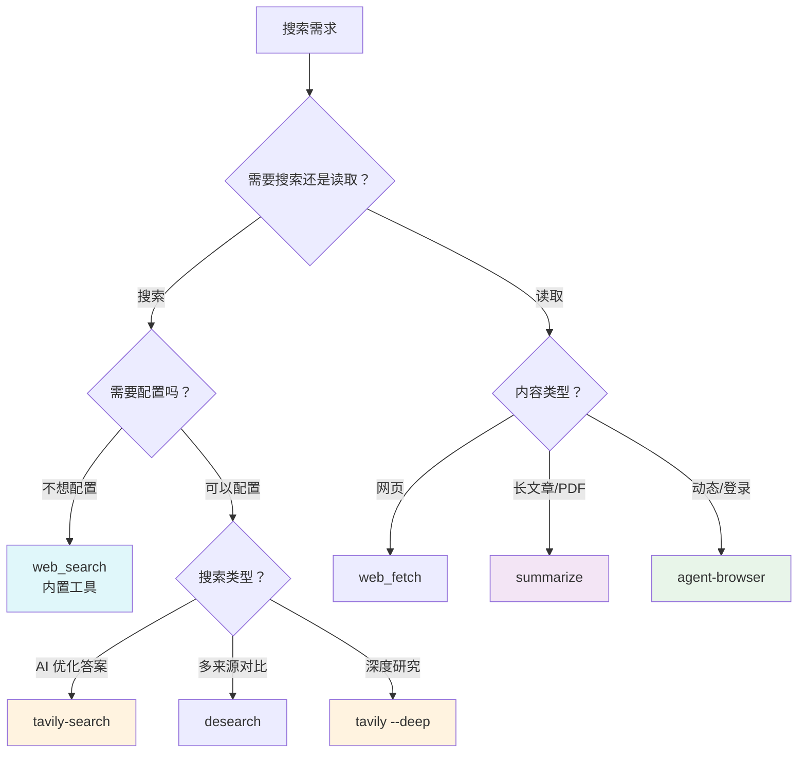
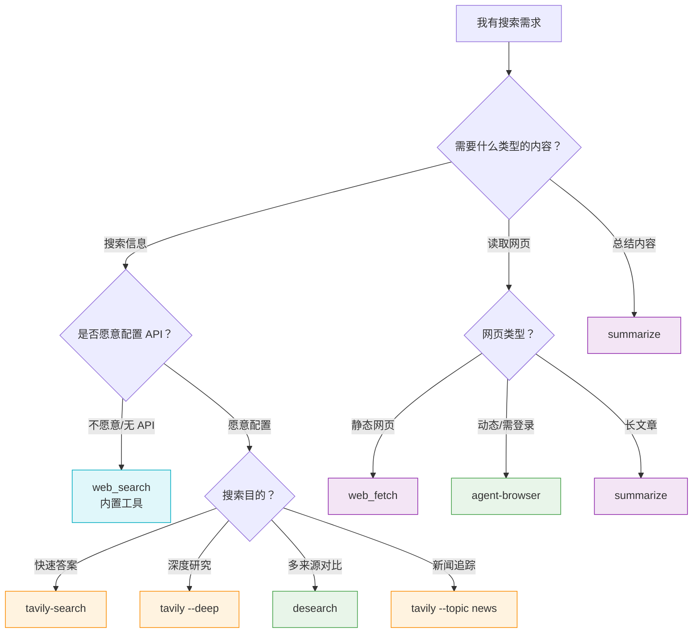

# 🔍 搜索工具全景指南

> **OpenClaw 搜索技能完全对比分析**  
> 📅 生成时间：2026-03-05 | 📊 版本：1.0

---

## 📖 目录

1. [快速概览](#-快速概览)
2. [内置工具 vs Skills](#-内置工具-vs-skills)
3. [深度对比分析](#-深度对比分析)
4. [使用场景决策树](#-使用场景决策树)
5. [配置指南](#-配置指南)
6. [最佳实践](#-最佳实践)

---

## 🎯 快速概览

### 工具矩阵

| 工具 | 类型 | 配置难度 | 速度 | 准确性 | 推荐指数 |
|:----:|:----:|:--------:|:----:|:------:|:--------:|
| **web_search** | 内置 | ⭐ 无需 | ⚡⚡⚡ | ⭐⭐⭐⭐ | ⭐⭐⭐⭐⭐ |
| **tavily-search** | Skill | ⭐⭐ API Key | ⚡⚡ | ⭐⭐⭐⭐⭐ | ⭐⭐⭐⭐⭐ |
| **desearch-web-search** | Skill | ⭐⭐ API Key | ⚡⚡ | ⭐⭐⭐⭐ | ⭐⭐⭐ |
| **web_fetch** | 内置 | ⭐ 无需 | ⚡⚡⚡ | ⭐⭐⭐ | ⭐⭐⭐⭐ |
| **agent-browser** | Skill | ⭐⭐⭐ 安装 CLI | ⚡ | ⭐⭐⭐⭐⭐ | ⭐⭐⭐⭐ |
| **summarize** | Skill | ⭐⭐⭐ 模型 Key | ⚡⚡ | ⭐⭐⭐⭐⭐ | ⭐⭐⭐⭐ |

### 一图看懂



---

## 🛠️ 内置工具 vs Skills

### 内置工具（无需安装）

| 工具 | 命令 | 说明 |
|------|------|------|
| `web_search` | 自动调用 | Brave Search API，开箱即用 |
| `web_fetch` | 自动调用 | 网页内容提取为 Markdown |

**✅ 优势：**
- 无需安装配置
- 响应速度快
- 稳定可靠

**❌ 局限：**
- 功能相对基础
- 结果数量有限（最多 10 条）

---

### Skills（需安装配置）

| Skill | 安装命令 | 配置要求 |
|-------|----------|----------|
| `tavily-search` | `clawhub install tavily-search` | `TAVILY_API_KEY` |
| `desearch-web-search` | `clawhub install desearch-web-search` | `DESEARCH_API_KEY` |
| `agent-browser` | `clawhub install agent-browser` | 安装 CLI + 浏览器 |
| `summarize` | `clawhub install summarize` | 模型 API Key |

---

## 📊 深度对比分析

### 1. web_search（内置）

```
┌─────────────────────────────────────────────────────────┐
│  🔍 web_search - 内置搜索引擎                            │
├─────────────────────────────────────────────────────────┤
│  后端：Brave Search API                                 │
│  配置：无需                                             │
│  速度：⚡⚡⚡ 极快                                        │
│  结果：最多 10 条                                        │
└─────────────────────────────────────────────────────────┘
```

**使用示例：**
```bash
# 基础搜索
web_search "量子计算最新进展"

# 限定时间
web_search "AI 新闻" --freshness pd

# 地区限定
web_search "德国旅游" --country DE --search_lang de
```

**适用场景：**
- ✅ 日常快速搜索
- ✅ 无需额外配置
- ✅ 需要地区/语言过滤
- ✅ 时效性内容（新闻、事件）

**不适用场景：**
- ❌ 需要超过 10 条结果
- ❌ 需要深度研究摘要
- ❌ 需要提取网页全文

---

### 2. tavily-search（Skill）

```
┌─────────────────────────────────────────────────────────┐
│  🎯 tavily-search - AI 优化搜索引擎                      │
├─────────────────────────────────────────────────────────┤
│  后端：Tavily API                                       │
│  配置：TAVILY_API_KEY                                   │
│  速度：⚡⚡ 快                                            │
│  特色：AI 摘要、深度搜索、新闻模式                        │
└─────────────────────────────────────────────────────────┘
```

**使用示例：**
```bash
# 基础搜索（5 条结果）
node ~/.openclaw/workspace/skills/tavily-search/scripts/search.mjs "query"

# 更多结果
node .../search.mjs "query" -n 10

# 深度搜索
node .../search.mjs "query" --deep

# 新闻搜索（最近 7 天）
node .../search.mjs "query" --topic news --days 7

# 提取网页内容
node .../extract.mjs "https://example.com/article"
```

**适用场景：**
- ✅ 需要 AI 友好的干净摘要
- ✅ 深度研究/写报告
- ✅ 追踪新闻/时事
- ✅ 提取网页全文

**不适用场景：**
- ❌ 没有 API Key
- ❌ 需要传统搜索结果格式

---

### 3. desearch-web-search（Skill）

```
┌─────────────────────────────────────────────────────────┐
│  🌐 desearch - 传统 SERP 搜索引擎                        │
├─────────────────────────────────────────────────────────┤
│  后端：Desearch API                                     │
│  配置：DESEARCH_API_KEY                                 │
│  速度：⚡⚡ 快                                            │
│  特色：分页、传统搜索结果格式                            │
└─────────────────────────────────────────────────────────┘
```

**使用示例：**
```bash
# 基础搜索（10 条结果）
desearch.py web "quantum computing"

# 分页获取下一页
desearch.py web "quantum computing" --start 10
```

**适用场景：**
- ✅ 需要传统搜索引擎结果
- ✅ 需要分页浏览大量结果
- ✅ 多来源对比分析

**不适用场景：**
- ❌ 没有 API Key
- ❌ 需要 AI 优化摘要

---

### 4. web_fetch（内置）

```
┌─────────────────────────────────────────────────────────┐
│  📄 web_fetch - 网页内容提取器                           │
├─────────────────────────────────────────────────────────┤
│  后端：HTML 解析器                                       │
│  配置：无需                                             │
│  速度：⚡⚡⚡ 极快                                        │
│  输出：Markdown / 纯文本                                  │
└─────────────────────────────────────────────────────────┘
```

**使用示例：**
```bash
# 提取为 Markdown
web_fetch https://example.com/article --extractMode markdown

# 提取为纯文本
web_fetch https://example.com/article --extractMode text
```

**适用场景：**
- ✅ 读取指定网页全文
- ✅ 博客文章、文档
- ✅ 静态网页内容

**不适用场景：**
- ❌ 动态加载内容
- ❌ 需要登录的网站
- ❌ 复杂交互页面

---

### 5. agent-browser（Skill）

```
┌─────────────────────────────────────────────────────────┐
│  🖥️ agent-browser - 浏览器自动化                         │
├─────────────────────────────────────────────────────────┤
│  后端：Playwright + Rust CLI                            │
│  配置：安装 CLI + 浏览器依赖                             │
│  速度：⚡ 中等（完整浏览器）                              │
│  特色：点击、填写、截图、录屏、自动化                    │
└─────────────────────────────────────────────────────────┘
```

**使用示例：**
```bash
# 打开网页
agent-browser open https://example.com

# 获取页面元素
agent-browser snapshot -i

# 点击元素
agent-browser click @e1

# 填写表单
agent-browser fill @e2 "text"

# 截图
agent-browser screenshot path.png

# 录屏
agent-browser record start ./demo.webm
# ... 执行操作 ...
agent-browser record stop
```

**适用场景：**
- ✅ 动态加载内容（SPA）
- ✅ 需要登录的网站
- ✅ 填写表单/提交数据
- ✅ 网页自动化测试
- ✅ 截图/录屏演示

**不适用场景：**
- ❌ 简单搜索需求
- ❌ 追求速度
- ❌ 静态内容提取

---

### 6. summarize（Skill）

```
┌─────────────────────────────────────────────────────────┐
│  🧾 summarize - 智能摘要工具                             │
├─────────────────────────────────────────────────────────┤
│  后端：多模型支持（Gemini/GPT/Claude 等）                 │
│  配置：模型 API Key                                      │
│  速度：⚡⚡ 快（取决于模型）                               │
│  特色：URL/PDF/YouTube 摘要、长度可控                     │
└─────────────────────────────────────────────────────────┘
```

**使用示例：**
```bash
# 总结网页
summarize "https://long-article.com" --model google/gemini-3-flash-preview

# 总结 PDF
summarize "/path/to/file.pdf" --length short

# 总结 YouTube 视频
summarize "https://youtu.be/dQw4w9WgXcQ" --youtube auto

# 控制摘要长度
summarize "https://..." --length short|medium|long|xl
```

**适用场景：**
- ✅ 长文章快速了解
- ✅ PDF 文档摘要
- ✅ YouTube 视频总结
- ✅ 多语言内容理解

**不适用场景：**
- ❌ 没有模型 API Key
- ❌ 需要原始内容而非摘要

---

## 🌲 使用场景决策树



---

## ⚙️ 配置指南

### 快速获取 API Keys

| 服务 | 获取地址 | 免费额度 |
|------|----------|----------|
| Tavily | https://tavily.com | ✅ 有免费额度 |
| Desearch | https://console.desearch.ai | ✅ 有免费额度 |
| Google Gemini | https://aistudio.google.com | ✅ 有免费额度 |
| OpenAI | https://platform.openai.com | ❌ 需付费 |
| Anthropic | https://console.anthropic.com | ❌ 需付费 |

### 环境变量配置

```bash
# 添加到 ~/.bashrc 或 ~/.zshrc
export TAVILY_API_KEY="your_tavily_key"
export DESEARCH_API_KEY="your_desearch_key"
export GEMINI_API_KEY="your_gemini_key"

# 使配置生效
source ~/.bashrc  # 或 source ~/.zshrc
```

### 验证配置

```bash
# Tavily
node ~/.openclaw/workspace/skills/tavily-search/scripts/search.mjs "test"

# Desearch
desearch.py web "test"

# Summarize
summarize "https://example.com"
```

---

## 🏆 最佳实践

### 推荐工作流

```
┌─────────────────────────────────────────────────────────────┐
│                    搜索需求处理流程                          │
├─────────────────────────────────────────────────────────────┤
│                                                             │
│  1️⃣  先用 web_search（内置，零配置）                         │
│       ↓                                                     │
│  2️⃣  需要深度？→ tavily-search --deep                       │
│       ↓                                                     │
│  3️⃣  需要读网页？→ web_fetch                                │
│       ↓                                                     │
│  4️⃣  内容太长？→ summarize                                  │
│       ↓                                                     │
│  5️⃣  需要交互？→ agent-browser                              │
│                                                             │
└─────────────────────────────────────────────────────────────┘
```

### 成本优化建议

| 策略 | 说明 |
|------|------|
| 🎯 **优先内置工具** | `web_search` 和 `web_fetch` 无需 API Key |
| 📊 **按需选择深度** | 简单问题不用 `--deep` 模式 |
| 🔄 **缓存结果** | 相同查询避免重复调用 |
| ⏰ **批量处理** | 多个查询合并处理 |

### 性能对比

```
搜索速度对比（平均响应时间）
━━━━━━━━━━━━━━━━━━━━━━━━━━━━━━━━━━━━━━━
web_search      ████████████████████  ~1s
web_fetch       ████████████████████  ~1s
tavily          ██████████████        ~1.5s
desearch        ██████████████        ~1.5s
summarize       ████████████          ~2s
agent-browser   ████████              ~3-5s
━━━━━━━━━━━━━━━━━━━━━━━━━━━━━━━━━━━━━━━
```

---

## 📋 快速参考卡片

### 命令速查

```
┌────────────────────────────────────────────────────────────┐
│  搜索命令速查                                               │
├────────────────────────────────────────────────────────────┤
│                                                            │
│  🔍 web_search "query" [-n 10] [--freshness pd/pw/pm/py]  │
│                                                            │
│  🎯 tavily: node .../search.mjs "query" [-n N] [--deep]   │
│     新闻：--topic news --days 7                            │
│     提取：node .../extract.mjs "url"                       │
│                                                            │
│  🌐 desearch: desearch.py web "query" [--start N]         │
│                                                            │
│  📄 web_fetch: web_fetch "url" [--extractMode markdown]   │
│                                                            │
│  🧾 summarize: summarize "url" [--length short/long]      │
│              summarize "file.pdf"                          │
│              summarize "youtube_url" --youtube auto        │
│                                                            │
│  🖥️ agent-browser: open/snapshot/click/fill/screenshot    │
│                                                            │
└────────────────────────────────────────────────────────────┘
```

---

## 🎓 总结

### 工具选择一句话指南

| 场景 | 推荐工具 |
|------|----------|
| 日常搜索 | `web_search`（内置） |
| 深度研究 | `tavily-search --deep` |
| 新闻追踪 | `tavily-search --topic news` |
| 读网页 | `web_fetch` |
| 长文总结 | `summarize` |
| 动态网页 | `agent-browser` |

### 最终建议

> 💡 **80% 的场景用内置工具就够了**  
> `web_search` + `web_fetch` 可以解决大部分需求  
> 只有在特殊场景（深度研究、动态网页、长文总结）才需要 Skills

---

<div align="center">

**📚 文档版本：** 1.0  
**📅 最后更新：** 2026-03-05  
**🔗 相关资源：** [OpenClaw Docs](https://docs.openclaw.ai) | [ClawHub](https://clawhub.com)

---

*Made with ❤️ for OpenClaw Users*

</div>
